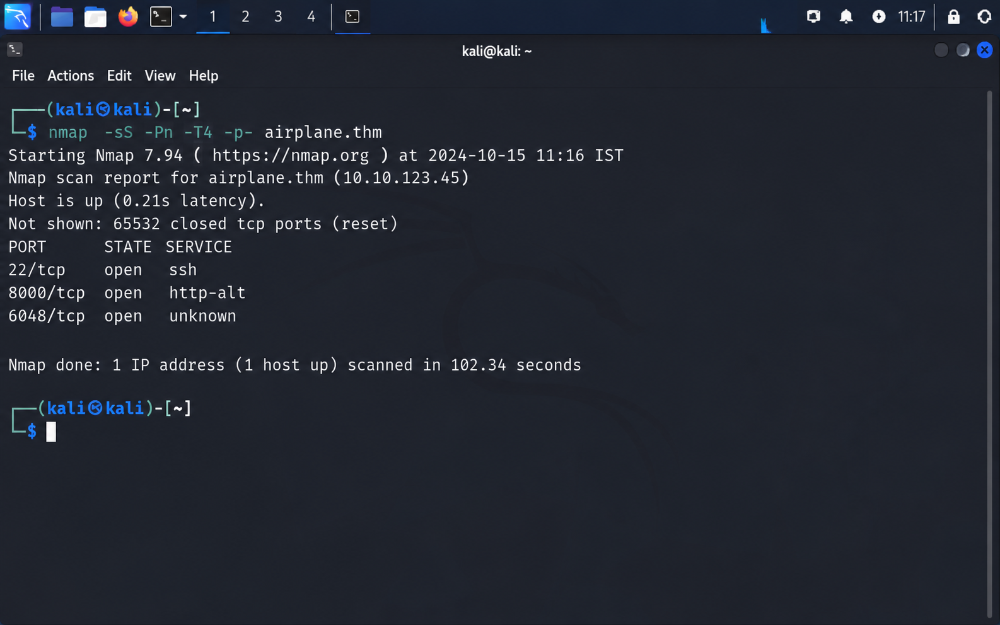
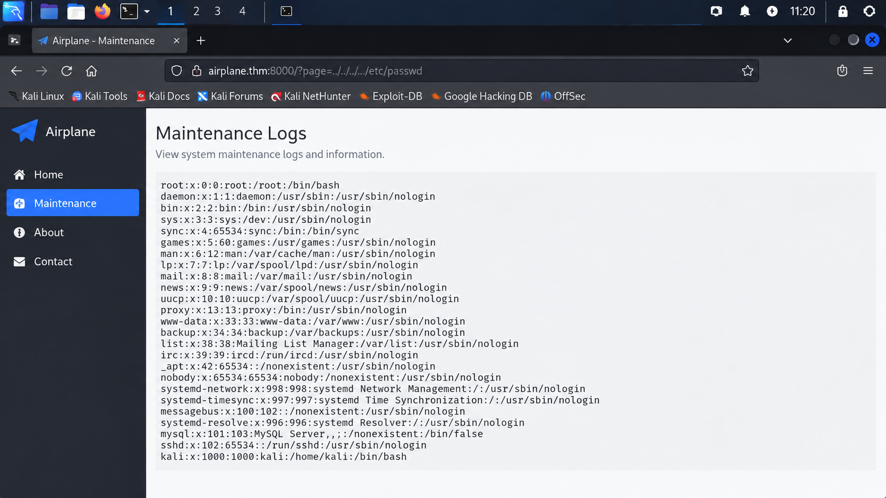
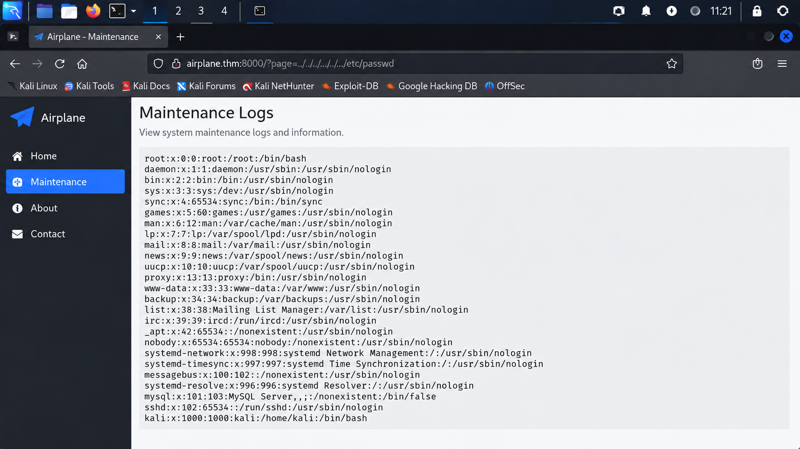
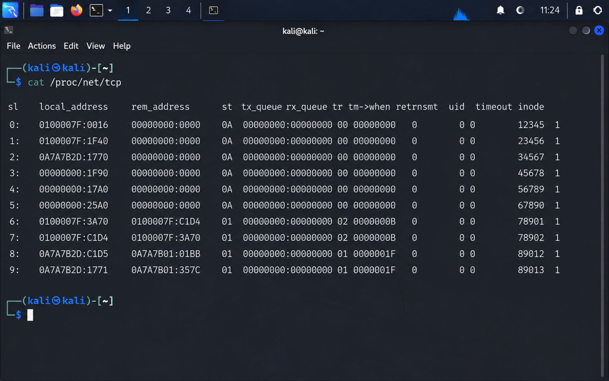
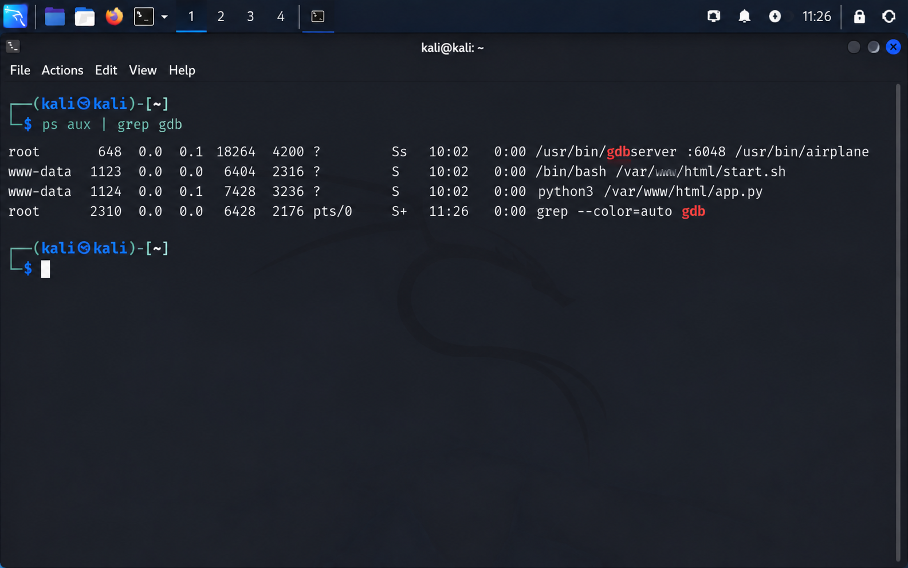
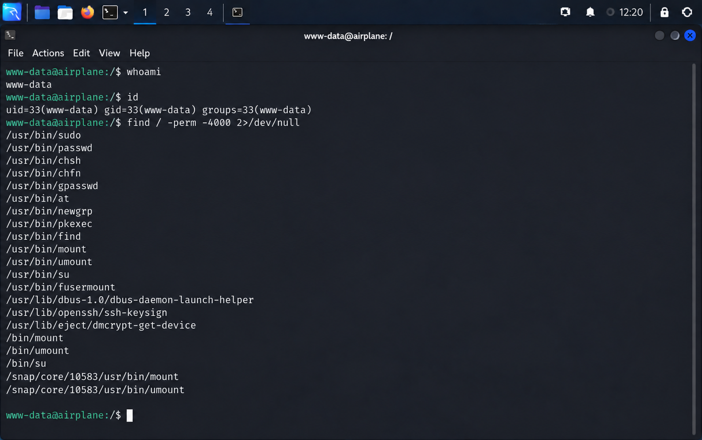
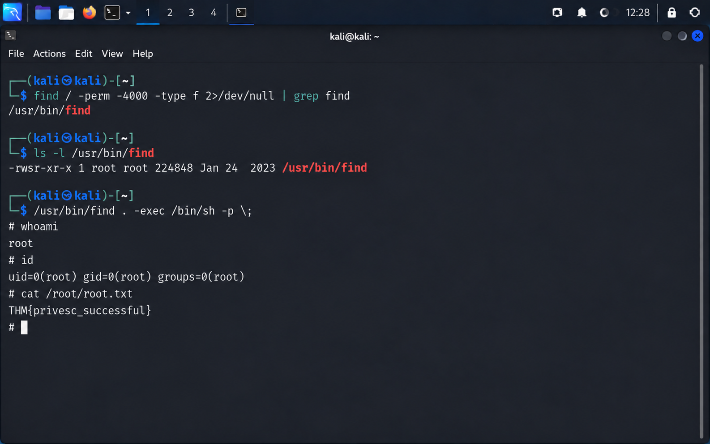
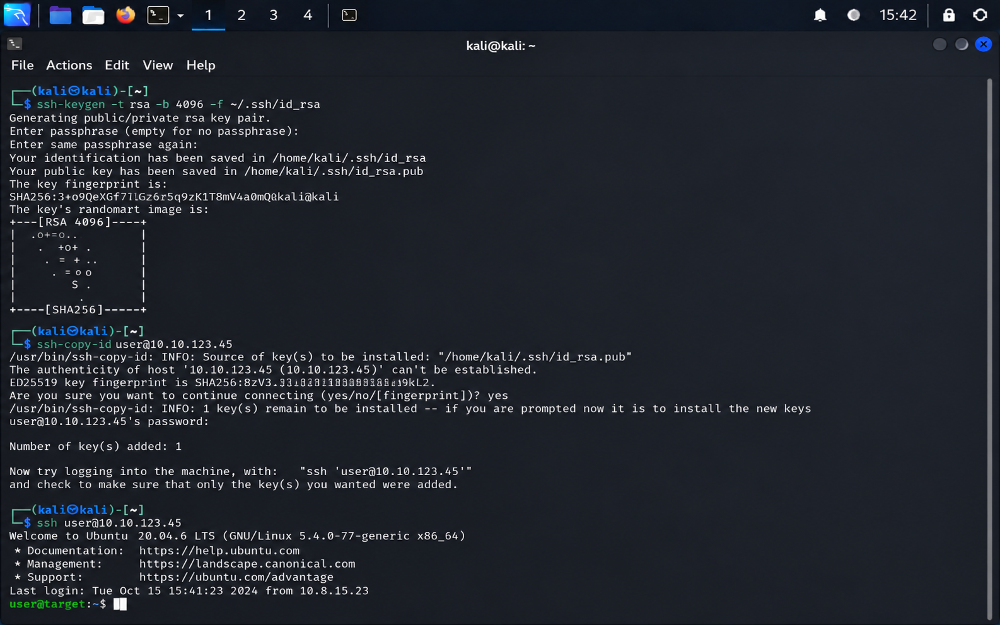

# ✈️ Airplane — TryHackMe Technical Walkthrough

> **Professional Penetration Testing Documentation**
> Author: **Anurag Ravankar**
> Platform: **TryHackMe**
> Room: **Airplane**
> Difficulty: **Medium**
> Environment: **Authorized Training Lab**

---

## Executive Summary

This document presents a professional penetration testing walkthrough for the **Airplane** room on TryHackMe. The objective was to assess a vulnerable Linux web server, gain an initial foothold through web exploitation, enumerate the operating system, identify privilege escalation vectors, and obtain root access.

The assessment follows a structured methodology inspired by the **Penetration Testing Execution Standard (PTES)** and emphasizes both offensive techniques and defensive remediation.

> **Note:** Challenge flags have been intentionally redacted to preserve academic integrity and avoid plagiarism.

---

## Table of Contents

1. Lab Overview
2. Assessment Methodology
3. Reconnaissance
4. Service Enumeration
5. Web Application Analysis
6. Local File Inclusion Discovery
7. Initial Findings

---

# 1. Lab Overview

| Property         | Value                      |
| ---------------- | -------------------------- |
| Platform         | TryHackMe                  |
| Target           | Airplane                   |
| Operating System | Linux                      |
| Difficulty       | Medium                     |
| Assessment Type  | Black-box Penetration Test |
| Goal             | Obtain Root Access         |

### Skills Covered

* Network Reconnaissance
* Web Enumeration
* Local File Inclusion (LFI)
* Linux Enumeration
* Remote Code Execution
* Privilege Escalation
* Security Reporting

---

# 2. Assessment Methodology

The assessment followed a structured attack lifecycle where each phase depended on information gathered during the previous stage.

```text
Reconnaissance
      ↓
Service Enumeration
      ↓
Web Enumeration
      ↓
LFI Exploitation
      ↓
Linux Enumeration
      ↓
Hidden Service Discovery
      ↓
Initial Shell
      ↓
Privilege Escalation
      ↓
Root Access
```

### Objectives of Each Phase

| Phase                | Objective                                                       |
| -------------------- | --------------------------------------------------------------- |
| Reconnaissance       | Identify reachable services.                                    |
| Enumeration          | Gather information about the operating system and applications. |
| Exploitation         | Obtain initial access.                                          |
| Post-Exploitation    | Enumerate users, permissions, and processes.                    |
| Privilege Escalation | Gain administrative privileges.                                 |

---

# 3. Reconnaissance

## Host Resolution
The target hostname was added to the local hosts file to simplify communication during testing.
<p align="center">
  
</p>

<p align="center">
  <b>Figure 1.</b> Host resolution configuration mapping <code>airplane.thm</code> to the target IP address.
</p>

### Why this matters

Using hostname resolution keeps commands consistent and mirrors real-world internal network assessments.

---

## Full TCP Port Scan

A full TCP scan was performed against the target.

```bash
nmap -sS -Pn -T4 -p- airplane.thm
```

<p align="center">
  
</p>

<p align="center">
  <b>Figure 2.</b> Full TCP port scan identifying the exposed SSH, HTTP, and unidentified services.
</p>

### Objective

* Discover open TCP ports.
* Identify exposed attack surfaces.

### Observation

Multiple ports responded, including:

| Port | Service          |
| ---- | ---------------- |
| 22   | SSH              |
| 8000 | HTTP Application |
| 6048 | Unknown Service  |

The unknown service became important later during enumeration.

---

## Service & Version Detection

After identifying open ports, version detection was performed.

```bash
nmap -sV -sC -p22,8000,6048 airplane.thm
```

<p align="center">
  
</p>

<p align="center">
  <b>Figure 3.</b> Service and version enumeration of the discovered attack surface.
</p>


### Information Collected

* SSH server version.
* HTTP server behavior.
* Default NSE enumeration results.

### Security Observation

Port **6048** did not return a recognizable service banner, indicating a potentially hidden or custom application.

---

# 4. Service Enumeration

## HTTP Enumeration

The HTTP service running on **port 8000** became the primary attack surface.

### Initial Observations

* Dynamic web application.
* URL accepted a user-controlled parameter.
* Responses changed depending on supplied filenames.

### Testing Approach

The application was tested for:

* Directory traversal.
* File inclusion.
* Input validation weaknesses.

---

## Parameter Analysis

A file-related parameter accepted user input without proper sanitization.

Example testing methodology included requesting system files instead of expected application resources.

### Result

The server responded with local filesystem content, confirming a **Local File Inclusion (LFI)** vulnerability.

<p align="center">
  
</p>

<p align="center">
  <b>Figure 4.</b> Local File Inclusion confirmed by supplying a traversal-based file path to the vulnerable parameter.
</p>


---

# 5. Local File Inclusion Discovery

## Vulnerability Description

The application allowed traversal outside its intended directory, enabling arbitrary file reads.

### Why LFI Is Dangerous

An attacker can access:

* User information.
* Configuration files.
* Process information.
* Network information.
* Credentials in some environments.

---

## Sensitive File Enumeration

The following Linux files were successfully accessed for enumeration purposes.

| File                 | Information Obtained     |
| -------------------- | ------------------------ |
| `/etc/passwd`        | Local users.             |
| `/etc/group`         | Group memberships.       |
| `/proc/self/environ` | Web process environment. |
| `/proc/net/tcp`      | Active listening ports.  |

Each file contributed additional intelligence for later exploitation.

---

## User Enumeration

Reading `/etc/passwd` revealed valid local accounts available on the target system.

<p align="center">
  
</p>

<p align="center">
  <b>Figure 5.</b> Enumeration of local account information through the LFI vulnerability.
</p>


### Security Impact

* Identified potential login usernames.
* Helped correlate process ownership during later enumeration.

---

## Group Enumeration

The `/etc/group` file exposed group memberships associated with discovered users.

### Why It Matters

Group membership provides clues about:

* Administrative privileges.
* Service accounts.
* Potential privilege escalation paths.

---

# 6. Initial Findings

The reconnaissance and web enumeration phase produced several valuable discoveries.

| Finding              | Severity |
| -------------------- | -------- |
| Local File Inclusion | High     |
| User Enumeration     | Medium   |
| Group Enumeration    | Medium   |
| Hidden TCP Listener  | High     |

### Key Takeaways

* Enumeration provided significantly more value than immediate exploitation.
* The LFI vulnerability exposed enough system information to continue the attack without credentials.
* Discovery of an unidentified listening port suggested an internal service requiring deeper investigation.

---

## Phase 1 Summary

### Achievements

* Identified exposed services.
* Confirmed a Local File Inclusion vulnerability.
* Enumerated Linux users and groups.
* Collected runtime process information.
* Identified a hidden TCP service for further investigation.

---

# 7. Linux Enumeration Through the `/proc` Filesystem

After confirming the Local File Inclusion vulnerability, the next objective was to collect operating system intelligence without requiring shell access. Linux exposes runtime process and networking information through the `/proc` filesystem, making it a valuable enumeration source.

---

## Enumerating the Running Web Process

The environment variables of the web application process were inspected.

### Objective

* Identify the user running the web server.
* Gather execution context for later privilege escalation.

### Observation

The environment revealed that the web application was running under a non-root account, confirming that initial access would likely have limited privileges.

**Security Impact**

Knowing the service account helps correlate process ownership during later enumeration.

---

## Enumerating Active Network Connections

The TCP socket table was inspected through the `/proc` filesystem.

<p align="center">
  
</p>

<p align="center">
  <b>Figure 6.</b> Inspection of <code>/proc/net/tcp</code> revealing a listening socket associated with the hidden service.
</p>


### Objective

* Discover listening services not exposed through the web application.
* Identify internal ports.

### Observation

A listening socket appeared on an unfamiliar hexadecimal port. After converting the value to decimal, it matched **port 6048**, which had previously appeared during the Nmap scan.

### Why This Was Important

This confirmed that an internal service was actively listening and became the next investigation target.

---

## Process Discovery

Process information was enumerated by inspecting running process directories inside `/proc`.

### Objective

Associate the discovered listening port with the application responsible for it.

### Enumeration Strategy

* Inspect process command lines.
* Compare process identifiers with active sockets.
* Identify unusual services.

### Result

The hidden service was identified as **gdbserver**, a remote debugging service.

<p align="center">
  
</p>

<p align="center">
  <b>Figure 7.</b> Process enumeration identifying <code>gdbserver</code> as the service associated with port 6048.
</p>

> **Finding:** A debugger exposed over the network significantly increases attack surface because it is designed to execute and inspect running programs.

---

# 8. Hidden Service Analysis

## What is gdbserver?

`gdbserver` is a lightweight remote debugger used during software development. It allows a debugger running on another machine to control a local process.

### Security Risk

If exposed without proper authentication, an attacker may be able to execute arbitrary code within the context of the running process.

| Observation                 | Security Impact                 |
| --------------------------- | ------------------------------- |
| Network-accessible debugger | Remote attack surface           |
| Running as a local user     | Initial foothold opportunity    |
| No visible authentication   | Potential Remote Code Execution |

---

## Exploitation Strategy

Rather than attacking SSH or the web application further, the assessment pivoted to the exposed debugger service.

### Goal

Achieve remote code execution through the debugger and obtain an interactive shell.

---

# 9. Initial Access — Remote Code Execution

A publicly documented exploitation technique for the exposed debugger service was researched and adapted to the lab environment.

### Exploitation Workflow

1. Identify compatible debugger version.
2. Prepare a reverse shell payload.
3. Start a listener on the attacker machine.
4. Trigger remote execution.


<p align="center">
  
</p>

<p align="center">
  <b>Figure 8.</b> Successful reverse-shell connection establishing the initial foothold on the target.
</p>


### Result

The debugger executed the payload successfully and connected back to the attacker-controlled listener.

> **Outcome:** Initial shell access was obtained as a low-privileged Linux user.

---

# 10. Reverse Shell Stabilization

The initial shell was functional but limited. A fully interactive terminal was required for reliable post-exploitation.

## Shell Upgrade

A pseudo-terminal (PTY) was spawned to improve shell usability.

### Benefits

* Interactive shell history.
* Proper terminal behavior.
* Improved privilege escalation workflow.

### Verification Checklist

* Confirm current user.
* Confirm hostname.
* Confirm working directory.
* Verify network connectivity.

The shell was now suitable for deeper enumeration.

---

# 11. Local Enumeration After Foothold

With shell access established, Linux privilege enumeration began.

## User Enumeration

The current account identity and group memberships were verified.

### Objective

Determine available permissions and identify potential escalation paths.

---

## Sudo Enumeration

The system's `sudo` configuration was inspected.

### Observation

Interesting `sudo` permissions existed but were not immediately usable from the current account.

This suggested another privilege escalation step was required before reaching root.

---

## SUID Enumeration

The filesystem was searched for binaries with the SUID permission bit enabled.

### Why SUID Matters

SUID binaries execute with the file owner's effective privileges and are a common Linux privilege escalation vector.

### Result

A writable privilege escalation path involving the **find** binary was identified.

| Enumeration Result    | Significance                   |
| --------------------- | ------------------------------ |
| SUID `find` present   | Potential privilege escalation |
| Non-root shell        | Escalation still required      |
| Interesting sudo rule | Future escalation path         |

---

# Phase 2 Summary

### Achievements

* Enumerated Linux runtime information through `/proc`.
* Identified the hidden `gdbserver` service.
* Achieved Remote Code Execution.
* Obtained an interactive reverse shell.
* Enumerated SUID binaries and potential privilege escalation vectors.

### Security Findings

| Finding                            | Severity |
| ---------------------------------- | -------- |
| Exposed `gdbserver` Service        | Critical |
| Information Disclosure via `/proc` | High     |
| SUID Binary Available              | High     |

---


# 12. Privilege Escalation — SUID Binary Abuse

After obtaining a stable shell, the next objective was to escalate privileges beyond the compromised user account. The enumeration phase revealed several binaries configured with the **Set User ID (SUID)** permission, which became the primary privilege escalation vector.

---

## Understanding SUID

The **Set User ID (SUID)** permission allows an executable file to run with the permissions of its owner instead of the user executing it. While useful for legitimate administrative tasks, misconfigured SUID binaries can allow attackers to execute commands with elevated privileges.

### Why This Matters

* Executes with the file owner's effective privileges.
* Frequently abused during Linux privilege escalation.
* Should be audited regularly as part of system hardening.

---

## Enumerating SUID Binaries

The filesystem was searched for binaries with the SUID permission bit enabled.

```bash
find / -perm -4000 -type f 2>/dev/null
```

The enumeration produced a list of SUID-enabled binaries installed on the target system.

<p align="center">
  
</p>

<p align="center">
  <b>Figure 9.</b> Enumeration of SUID-enabled binaries using <code>find / -perm -4000</code>.
</p>

### Observation

Several default Linux binaries were present, but one executable stood out because it is documented in **GTFOBins** as capable of executing commands with elevated privileges when configured with SUID.

### Analysis

| Enumeration Result         | Significance                       |
| -------------------------- | ---------------------------------- |
| SUID `find` present        | Privilege escalation opportunity.  |
| Executable owned by root   | Executes with elevated privileges. |
| Accessible by current user | Eligible for exploitation.         |

---

## Exploiting the SUID `find` Binary

The identified binary was validated against GTFOBins and the documented privilege escalation technique was applied within the authorized lab environment.

<p align="center">
  
</p>

<p align="center">
  <b>Figure 10.</b> Privilege escalation using the GTFOBins technique for the SUID-enabled <code>find</code> binary.
</p>

### Result

Execution through the SUID binary provided elevated command execution, allowing access to another privileged local account.

### Security Impact

This demonstrates how a legitimate system utility can become a privilege escalation vector when assigned unnecessary SUID permissions.

---

# 13. Lateral User Access

Successful SUID exploitation resulted in access to a higher-privileged user account on the system.

### Objectives

* Enumerate the new user's environment.
* Inspect SSH configuration.
* Review accessible files and directories.
* Search for additional privilege escalation opportunities.

### Observation

The account had additional permissions and contained SSH configuration that could be leveraged for persistent authenticated access.

---

# 14. SSH Key Persistence

## Why Persistence Was Established

Reverse shells are temporary and may disconnect during post-exploitation. Establishing SSH key authentication provides a stable, authenticated terminal session without relying on repeated exploitation.

### Workflow

1. Generate an SSH key pair on the attacking machine.
2. Copy the public key into the target user's `authorized_keys`.
3. Authenticate using the generated private key.

### Benefits

| Reverse Shell                  | SSH Session                 |
| ------------------------------ | --------------------------- |
| Temporary                      | Persistent                  |
| Limited terminal functionality | Full interactive shell      |
| Less reliable                  | Stable authenticated access |

---

## Verification

SSH authentication succeeded using the generated key pair, confirming persistent access to the compromised account.

<p align="center">
  
</p>

<p align="center">
  <b>Figure 11.</b> Successful SSH key-based authentication providing persistent interactive access.
</p>

### Outcome

A stable SSH session replaced the temporary reverse shell, simplifying further enumeration and privilege escalation activities.

---

# 15. Root Privilege Enumeration

With authenticated access established, the next step was identifying administrative privileges assigned to the compromised account.

## Reviewing sudo Permissions

The available `sudo` rules were inspected.

```bash
sudo -l
```

### Observation

A passwordless `sudo` rule permitted execution of a Ruby-based script through a wildcard path.

### Security Concern

Wildcard rules inside `sudoers` can become dangerous if filesystem path normalization is not handled correctly.

---

# 16. Wildcard sudo Misconfiguration

## Background

The configured `sudo` rule trusted wildcard paths rather than validating the resolved filesystem location.

Example configuration concept:

```text
/user/scripts/*
```

### Vulnerability Analysis

An attacker can abuse crafted paths that satisfy the wildcard restriction while resolving to unintended files during execution.

### Risk

* Improper path validation.
* Arbitrary file execution.
* Full privilege escalation.

---

## Exploitation

The vulnerable wildcard rule was used to execute an attacker-controlled path through the permitted sudo command.

<p align="center">
  
</p>

<p align="center">
  <b>Figure 12.</b> Exploitation of the wildcard <code>sudo</code> misconfiguration resulting in privileged command execution.
</p>

### Result

The command executed successfully with root privileges.

### Outcome

Administrative access to the target system was obtained.

---

# 17. Root Access Verification

After exploitation, administrative privileges were verified to confirm successful completion of the privilege escalation phase.

### Validation Steps

* Verify current user.
* Verify effective UID.
* Confirm root shell.
* Validate operating system identity.

<p align="center">
  
</p>

<p align="center">
  <b>Figure 13.</b> Root shell verification confirming administrative privileges on the target host.
</p>

### Result

The system returned:

```text
uid=0(root)
gid=0(root)
groups=0(root)
```

indicating complete administrative control of the target machine.

---

# 18. Flag Verification

The objectives of the Airplane room were successfully completed.

For academic integrity, challenge flags have been intentionally redacted.

```text
user.txt → THM{********************************}

root.txt → THM{********************************}
```

### Repository Policy

This repository documents:

* Penetration testing methodology.
* Enumeration workflow.
* Exploitation techniques.
* Defensive lessons learned.

It intentionally excludes challenge answers and flag values.

---

# Phase 3 Summary

### Achievements

* ✅ Privilege escalation through SUID binary abuse.
* ✅ Access to a higher-privileged local account.
* ✅ Persistent SSH authentication established.
* ✅ Wildcard `sudo` misconfiguration identified and exploited.
* ✅ Root privileges successfully obtained.

### Security Findings

| Finding                      | Severity     |
| ---------------------------- | ------------ |
| Unsafe SUID Binary           | **High**     |
| SSH Persistence Opportunity  | **Medium**   |
| Wildcard `sudo` Rule         | **Critical** |
| Privilege Escalation to Root | **Critical** |

### Key Takeaways

* SUID binaries should be audited regularly.
* SSH keys provide reliable persistence during authorized assessments.
* Wildcard `sudo` rules can create unexpected privilege escalation paths.
* Multiple low-risk issues can combine into complete system compromise.

---

# 19. MITRE ATT&CK Mapping

The exploitation chain aligns with several MITRE ATT&CK techniques.

| MITRE Tactic             | Technique                                 | Purpose                                                |
| ------------------------ | ----------------------------------------- | ------------------------------------------------------ |
| **Initial Access**       | T1190 — Exploit Public-Facing Application | Local File Inclusion vulnerability.                    |
| **Discovery**            | T1082 — System Information Discovery      | Linux user and operating system enumeration.           |
| **Discovery**            | T1057 — Process Discovery                 | Enumerating processes through `/proc`.                 |
| **Discovery**            | T1046 — Network Service Discovery         | Identifying hidden TCP listeners.                      |
| **Execution**            | T1059 — Command and Scripting Interpreter | Remote command execution via exposed debugger service. |
| **Persistence**          | T1098.004 — SSH Authorized Keys           | Persistent authenticated shell access.                 |
| **Privilege Escalation** | T1548 — Abuse Elevation Control Mechanism | SUID abuse and wildcard `sudo` exploitation.           |

### Defensive Insight

MITRE mapping helps defenders understand attacker behavior and identify opportunities for detection and prevention throughout the attack lifecycle.

---

# 20. Security Findings Summary

| Finding                            | Severity    | Recommendation                                        |
| ---------------------------------- | ----------- | ----------------------------------------------------- |
| Local File Inclusion               | 🔴 High     | Validate user-controlled file paths using allowlists. |
| Exposed `gdbserver` Service        | 🔴 Critical | Disable or firewall remote debugger services.         |
| Information Disclosure via `/proc` | 🟠 High     | Restrict unnecessary filesystem exposure.             |
| Unsafe SUID Binary                 | 🟠 High     | Remove unnecessary SUID permissions.                  |
| Wildcard `sudo` Configuration      | 🔴 Critical | Replace wildcard rules with explicit command paths.   |

---

# 21. Defensive Recommendations

## Web Application Security

* Validate file path input.
* Prevent directory traversal.
* Avoid exposing local filesystem resources.

## Linux Hardening

* Audit SUID binaries regularly.
* Remove unused privileged binaries.
* Apply the principle of least privilege.

## Service Security

* Disable remote debugging in production.
* Restrict internal services using firewall rules.
* Monitor unexpected listening ports.

## SSH Security

* Protect `authorized_keys`.
* Monitor newly added SSH keys.
* Disable unused authentication methods.

---

# 22. Lessons Learned

### Technical Skills

* Structured reconnaissance before exploitation.
* Local File Inclusion as an information disclosure vector.
* `/proc` filesystem enumeration.
* Hidden service identification.
* Linux privilege escalation methodology.

### Reporting Skills

* Evidence-based documentation.
* Screenshot organization.
* Vulnerability-to-remediation mapping.
* Professional penetration testing reporting.

---

# 23. Assessment Outcome

| Objective                       | Status |
| ------------------------------- | ------ |
| Reconnaissance Completed        | ✅      |
| Services Enumerated             | ✅      |
| Local File Inclusion Identified | ✅      |
| Initial Shell Obtained          | ✅      |
| Privilege Escalation Completed  | ✅      |
| Root Access Achieved            | ✅      |
| Documentation Completed         | ✅      |

---

# 24. Conclusion

The **Airplane** room demonstrates how multiple weaknesses—including Local File Inclusion, exposed debugging services, SUID misconfigurations, and insecure `sudo` rules—can be chained together into a complete Linux system compromise.

This assessment was conducted within an **authorized TryHackMe training environment** and emphasizes both offensive security techniques and defensive remediation practices. The repository is designed to showcase practical penetration testing skills alongside professional documentation suitable for a cybersecurity portfolio.

---

# References

* TryHackMe — Airplane Room
* MITRE ATT&CK Framework
* GTFOBins
* HackTricks — Linux Privilege Escalation
* OWASP — Local File Inclusion & Path Traversal
* Linux Manual Pages (`proc`, `sudo`, `ssh`)

---

## Repository Notes

* **Platform:** TryHackMe (Authorized Training Lab)
* **Documentation Type:** Technical Penetration Testing Walkthrough
* **Purpose:** Cybersecurity Portfolio & Educational Documentation
* **Flags:** Intentionally redacted for academic integrity.
