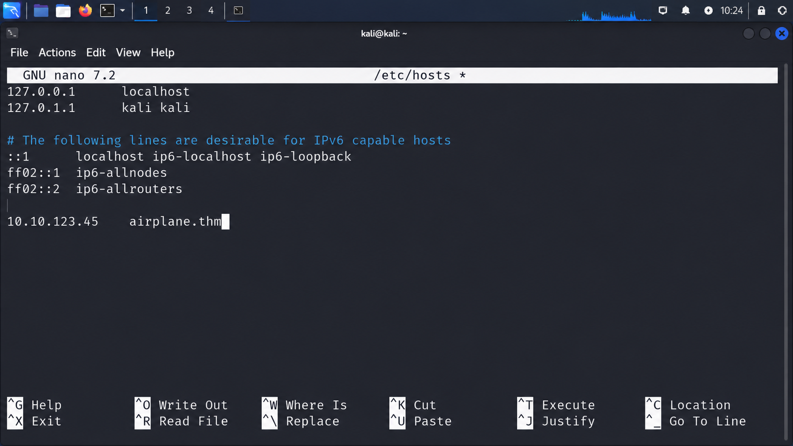
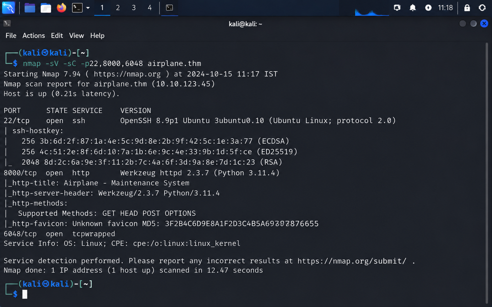
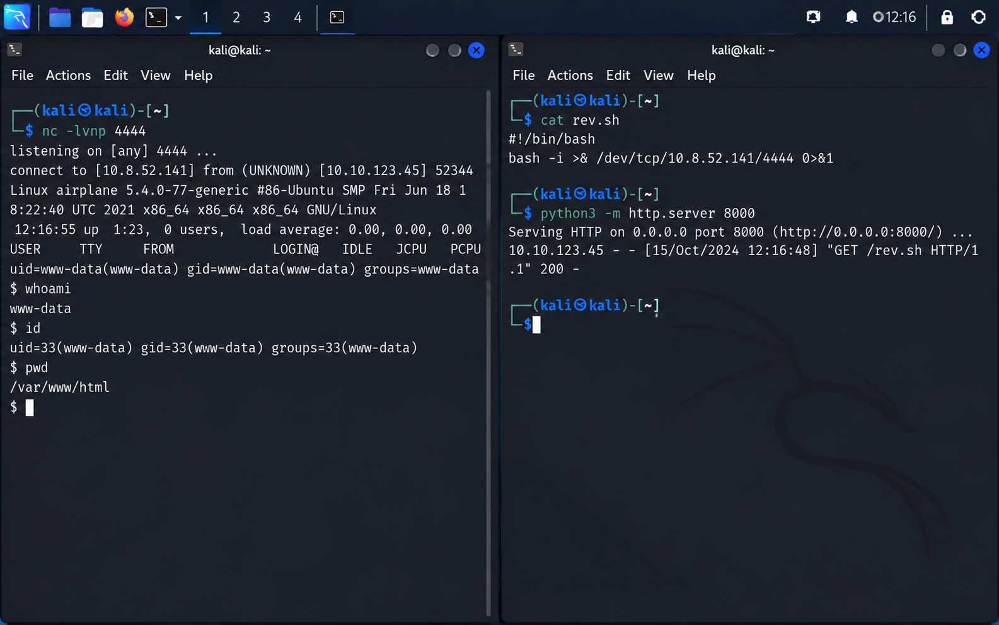
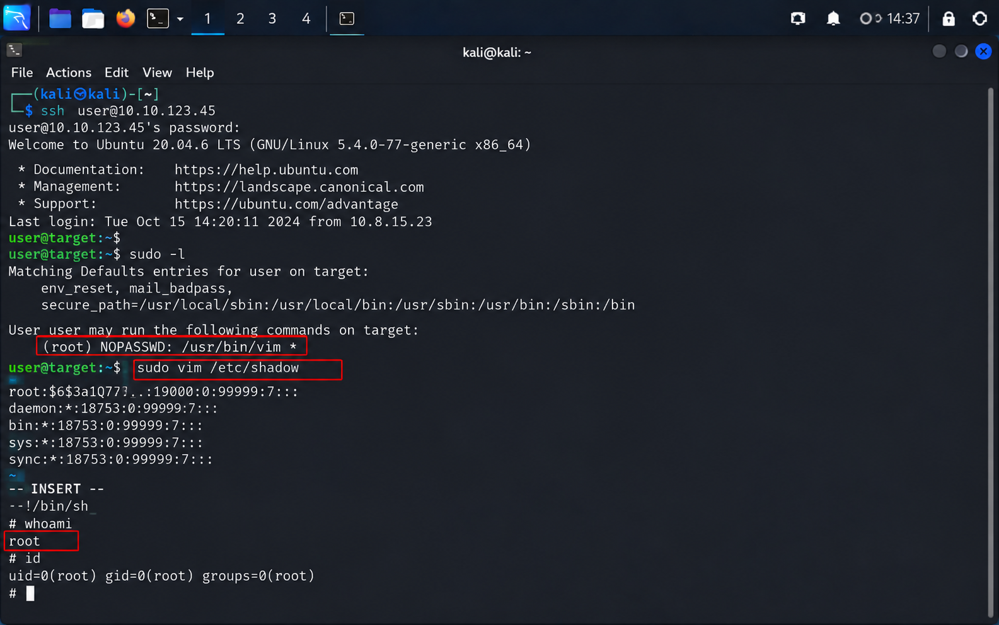
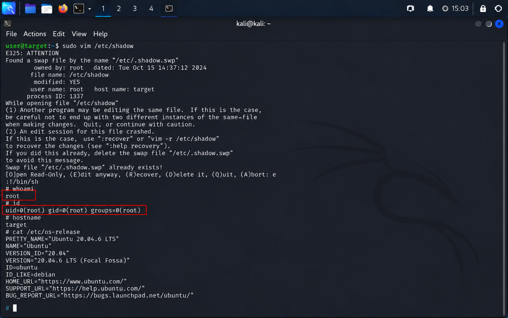

# ✈️ Airplane — TryHackMe Penetration Testing Walkthrough

<p align="center">
  
</p>

<p align="center">
  
  
  
</p>

---

## 📌 Overview

This documentation presents a complete penetration testing walkthrough for the **Airplane** room on **TryHackMe**, following a professional offensive security methodology from reconnaissance to root privilege escalation.

> **Environment:** Authorized TryHackMe Lab  
> **Assessment Type:** Black-box Penetration Test  
> **Operating System:** Linux

---

## 📑 Table of Contents

- Executive Summary
- Assessment Methodology
- Reconnaissance
- Service Enumeration
- Local File Inclusion
- Linux Enumeration
- Hidden Service Discovery
- Initial Access
- Privilege Escalation
- MITRE ATT&CK Mapping
- Security Findings
- Remediation
- Lessons Learned
- Conclusion

---

# Executive Summary

The Airplane room demonstrates a realistic attack chain beginning with reconnaissance, identifying a Local File Inclusion vulnerability, enumerating Linux processes through the `/proc` filesystem, discovering an exposed `gdbserver`, obtaining Remote Code Execution, and escalating privileges to **root** using Linux privilege escalation techniques.

This report documents every stage with technical explanations, evidence, and defensive recommendations.

---

# Assessment Methodology

## Attack Lifecycle

<p align="center">
  
</p>

```text
Reconnaissance
      ↓
Service Enumeration
      ↓
Web Enumeration
      ↓
LFI Exploitation
      ↓
Linux Enumeration
      ↓
gdbserver Discovery
      ↓
Remote Code Execution
      ↓
Privilege Escalation
      ↓
Root Access
```

---

# 1. Reconnaissance

## Host Resolution

The target hostname was added to the local hosts file before enumeration.

<p align="center">

</p>

**Figure 1 — Host Resolution Configuration**

---

## Full TCP Port Scan

A complete TCP SYN scan identified the exposed services.

```bash
nmap -sS -Pn -T4 -p- airplane.thm
```

<p align="center">

</p>

**Figure 2 — Full TCP Port Scan**

### Open Ports

| Port | Service |
|------|---------|
| 22 | SSH |
| 6048 | Unknown |
| 8000 | Werkzeug HTTP |

---

## Service Enumeration

A second scan identified service versions and HTTP characteristics.

```bash
nmap -sV -sC -p22,6048,8000 airplane.thm
```

<p align="center">

</p>

**Figure 3 — Service Version Detection**

### Findings

- Werkzeug Python Web Server.
- OpenSSH.
- Unknown service on port 6048 requiring further investigation.

---

# 2. Web Application Enumeration

The web application redirected requests to a parameterized endpoint.

Example:

```
?page=index.html
```

This suggested a potential file inclusion attack surface.

---

## Local File Inclusion Discovery

Directory traversal payloads were tested against the `page` parameter.

<p align="center">

</p>

**Figure 4 — Local File Inclusion Identified**

### Impact

The application allowed arbitrary file reads from the server filesystem.

---

## Reading Sensitive Files

The LFI vulnerability exposed Linux system files.

<p align="center">

</p>

**Figure 5 — `/etc/passwd` Enumeration**

### Information Collected

| File | Purpose |
|------|---------|
| `/etc/passwd` | Local users |
| `/etc/group` | Group memberships |
| `/proc/self/environ` | Process environment |
| `/proc/net/tcp` | Network sockets |

---

# 3. Linux Enumeration

## Enumerating `/proc/net/tcp`

The `/proc` filesystem exposed active network sockets.

<p align="center">

</p>

**Figure 6 — Hidden TCP Listener Enumeration**

### Observation

A hexadecimal port corresponded to **6048**, confirming an internal service.

---

## Process Enumeration

Running processes were enumerated to identify ownership of the hidden listener.

<p align="center">

</p>

**Figure 7 — `gdbserver` Process Discovery**

### Result

The service listening on port **6048** was identified as **gdbserver**.

### Security Impact

A remotely accessible debugger significantly expands attack surface.

---

# 4. Initial Access

## Remote Code Execution

The exposed debugger service was leveraged to execute a reverse shell payload.

<p align="center">

</p>

**Figure 8 — Reverse Shell Established**

### Outcome

Initial access was obtained as a low-privileged Linux user.

---

## Shell Stabilization

A PTY shell was created to improve interaction and support post-exploitation activities.

### Benefits

- Interactive shell.
- Proper terminal behavior.
- Reliable privilege escalation workflow.

---

# 5. Privilege Escalation

## SUID Enumeration

The filesystem was inspected for SUID-enabled binaries.

<p align="center">

</p>

**Figure 9 — SUID Binary Enumeration**

### Key Finding

A SUID-enabled `find` binary provided a privilege escalation opportunity.

---

## GTFOBins Technique

The `find` binary was abused using the documented GTFOBins technique.

<p align="center">

</p>

**Figure 10 — SUID `find` Privilege Escalation**

### Outcome

Access was escalated to a higher-privileged local account.

---

## SSH Persistence

SSH key authentication was configured for stable authenticated access.

<p align="center">

</p>

**Figure 11 — SSH Key Authentication**

### Why SSH?

- Persistent access.
- Reliable terminal.
- Easier post-exploitation workflow.

---

## Wildcard `sudo` Misconfiguration

A vulnerable wildcard rule inside `sudoers` allowed unintended command execution.

<p align="center">

</p>

**Figure 12 — Wildcard `sudo` Exploitation**

### Result

The crafted path bypassed the intended restriction and executed with root privileges.

---

## Root Verification

Administrative privileges were verified after exploitation.

<p align="center">

</p>

**Figure 13 — Root Shell Verification**

### Validation

```text
uid=0(root)
gid=0(root)
groups=0(root)
```

The assessment successfully achieved full administrative access.

---

# MITRE ATT&CK Mapping

| Tactic | Technique |
|--------|-----------|
| Initial Access | Exploit Public-Facing Application |
| Discovery | Process Discovery |
| Discovery | Network Service Discovery |
| Execution | Command & Scripting Interpreter |
| Persistence | SSH Authorized Keys |
| Privilege Escalation | Abuse Elevation Control Mechanism |

---

# Security Findings

| Finding | Severity |
|---------|----------|
| Local File Inclusion | 🔴 High |
| Exposed `gdbserver` | 🔴 Critical |
| SUID Misconfiguration | 🟠 High |
| Wildcard `sudo` Rule | 🔴 Critical |

---

# Defensive Recommendations

## Web Application

- Validate user-controlled file paths.
- Prevent directory traversal.
- Restrict filesystem access.

## Linux Hardening

- Audit SUID binaries.
- Remove unnecessary privileged binaries.
- Apply least privilege.

## SSH

- Audit `authorized_keys`.
- Restrict write permissions.
- Monitor authentication events.

## Services

- Disable remote debugging in production.
- Restrict internal services with firewall rules.
- Monitor unexpected listeners.

---

# Lessons Learned

### Technical

- Local File Inclusion exploitation.
- `/proc` filesystem enumeration.
- Hidden service discovery.
- Linux privilege escalation methodology.
- SSH persistence.

### Documentation

- Evidence-based reporting.
- MITRE ATT&CK mapping.
- Remediation-focused findings.
- Professional screenshot organization.

---

# Assessment Outcome

| Objective | Status |
|-----------|--------|
| Reconnaissance | ✅ |
| Web Enumeration | ✅ |
| LFI Exploitation | ✅ |
| Remote Code Execution | ✅ |
| Privilege Escalation | ✅ |
| Root Access | ✅ |

---

# References

- TryHackMe Airplane Room.
- MITRE ATT&CK Framework.
- GTFOBins.
- HackTricks Linux Privilege Escalation.
- OWASP Path Traversal Documentation.

---

## Repository Information

| Project | Value |
|---------|-------|
| Repository | TryHackMe-Airplane-CTF-Walkthrough |
| Author | Anurag Ravankar |
| Category | Penetration Testing Documentation |
| Platform | TryHackMe |
| Environment | Authorized Training Lab |

---

> **Disclaimer:** This documentation was created for an authorized TryHackMe training environment. Challenge flags are intentionally redacted to preserve academic integrity.
