<div class="ctf-hero">

# ✈️ Airplane — TryHackMe Penetration Testing Walkthrough

<p>
This documentation presents a complete penetration testing walkthrough for the <strong>Airplane</strong> room on <strong>TryHackMe</strong>, following a professional offensive security methodology from reconnaissance through web exploitation, Linux enumeration, remote code execution, privilege escalation, and root access.
</p>

<div class="ctf-badges">
  <span class="ctf-badge">TryHackMe</span>
  <span class="ctf-badge">Linux</span>
  <span class="ctf-badge">Medium</span>
  <span class="ctf-badge">Web Exploitation</span>
  <span class="ctf-badge">Penetration Testing</span>
</div>

</div>

---

## Quick Overview

<div class="ctf-card-grid">

<div class="ctf-card">
<div class="ctf-card-title">Platform</div>
<div class="ctf-card-value">TryHackMe</div>
</div>

<div class="ctf-card">
<div class="ctf-card-title">Room</div>
<div class="ctf-card-value">Airplane</div>
</div>

<div class="ctf-card">
<div class="ctf-card-title">Difficulty</div>
<div class="ctf-card-value">Medium</div>
</div>

<div class="ctf-card">
<div class="ctf-card-title">Operating System</div>
<div class="ctf-card-value">Linux</div>
</div>

<div class="ctf-card">
<div class="ctf-card-title">Category</div>
<div class="ctf-card-value">Web Exploitation</div>
</div>

<div class="ctf-card">
<div class="ctf-card-title">Assessment Type</div>
<div class="ctf-card-value">Black-box Penetration Test</div>
</div>

<div class="ctf-card">
<div class="ctf-card-title">Environment</div>
<div class="ctf-card-value">Authorized TryHackMe Lab</div>
</div>

<div class="ctf-card">
<div class="ctf-card-title">Assessment Outcome</div>
<div class="ctf-card-value">Root Access Achieved</div>
</div>

</div>

---

## Navigation

<div class="ctf-toc">

<div class="ctf-toc-title">Navigation</div>

- [Executive Summary](#executive-summary)
- [Assessment Methodology](#assessment-methodology)
- [Attack Chain](#attack-chain)
- [Reconnaissance](#1-reconnaissance)
  - [Host Resolution](#host-resolution)
  - [Full TCP Port Scan](#full-tcp-port-scan)
  - [Service Enumeration](#service-enumeration)
- [Web Application Enumeration](#2-web-application-enumeration)
  - [Local File Inclusion Discovery](#local-file-inclusion-discovery)
  - [Reading Sensitive Files](#reading-sensitive-files)
- [Linux Enumeration](#3-linux-enumeration)
  - [Enumerating `/proc/net/tcp`](#enumerating-procnettcp)
  - [Process Enumeration](#process-enumeration)
- [Initial Access](#4-initial-access)
  - [Remote Code Execution](#remote-code-execution)
  - [Shell Stabilization](#shell-stabilization)
- [Privilege Escalation](#5-privilege-escalation)
  - [SUID Enumeration](#suid-enumeration)
  - [GTFOBins Technique](#gtfobins-technique)
  - [SSH Persistence](#ssh-persistence)
  - [Wildcard `sudo` Misconfiguration](#wildcard-sudo-misconfiguration)
  - [Root Verification](#root-verification)
- [MITRE ATT&CK Mapping](#mitre-attck-mapping)
- [Tools Used](#tools-used)
- [Security Findings](#security-findings)
- [Security Recommendations](#security-recommendations)
- [Lessons Learned](#lessons-learned)
- [Assessment Outcome](#assessment-outcome)
- [References](#references)
- [Responsible Use](#responsible-use)
- [Repository Information](#repository-information)

</div>

---

## Executive Summary

The Airplane room demonstrates a realistic attack chain beginning with reconnaissance, identifying a **Local File Inclusion (LFI)** vulnerability, enumerating Linux processes through the `/proc` filesystem, discovering an exposed **`gdbserver`**, obtaining **Remote Code Execution**, and escalating privileges to **root** using Linux privilege escalation techniques.

The assessment demonstrates the relationship between web-layer vulnerabilities, local Linux enumeration, exposed internal services, remote code execution, SUID misconfiguration, SSH access, and a vulnerable wildcard `sudo` rule.

The documentation below records the observed methodology, commands, evidence, findings, and defensive recommendations.

---

## Assessment Methodology

The assessment followed an offensive security workflow progressing from external reconnaissance toward full administrative access.

<div class="attack-chain">

<div class="attack-step">Reconnaissance</div>
<div class="attack-arrow">→</div>
<div class="attack-step">Service Enumeration</div>
<div class="attack-arrow">→</div>
<div class="attack-step">Web Enumeration</div>
<div class="attack-arrow">→</div>
<div class="attack-step">LFI Exploitation</div>
<div class="attack-arrow">→</div>
<div class="attack-step">Linux Enumeration</div>
<div class="attack-arrow">→</div>
<div class="attack-step">gdbserver Discovery</div>
<div class="attack-arrow">→</div>
<div class="attack-step">Remote Code Execution</div>
<div class="attack-arrow">→</div>
<div class="attack-step">Privilege Escalation</div>
<div class="attack-arrow">→</div>
<div class="attack-step">Root Access</div>

</div>

<figure>
  
  <figcaption>Figure — Airplane attack chain from reconnaissance to root access.</figcaption>
</figure>

---

# 1. Reconnaissance

Reconnaissance established the target environment and identified the externally exposed attack surface.

## Host Resolution

The target hostname was added to the local hosts file before enumeration.

<figure>
  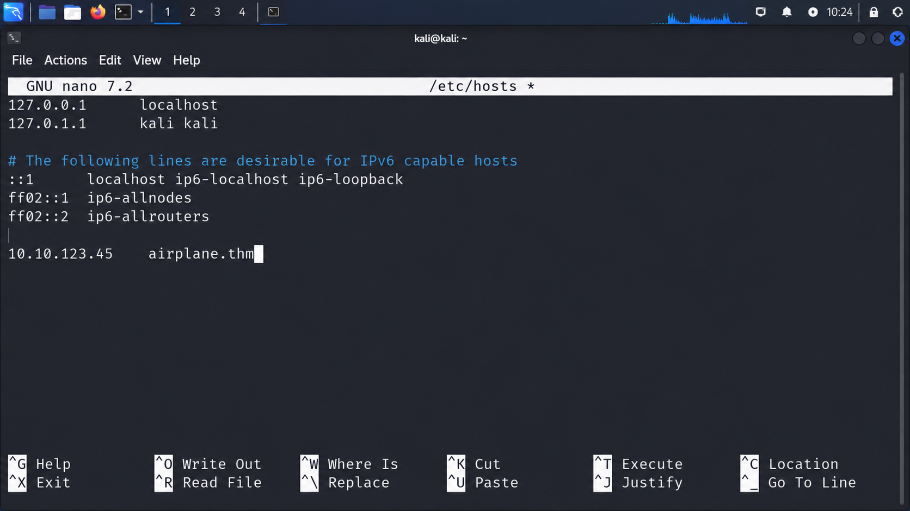
  <figcaption>Figure 1 — Host resolution configuration.</figcaption>
</figure>

---

## Full TCP Port Scan

A complete TCP SYN scan was performed to identify exposed TCP services.

```bash
nmap -sS -Pn -T4 -p- airplane.thm
```

<figure>
  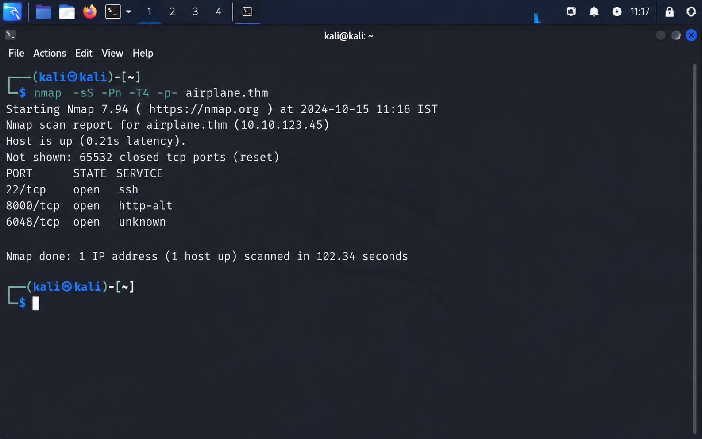
  <figcaption>Figure 2 — Full TCP port scan.</figcaption>
</figure>

### Exposed Services

| Port | Service |
|---:|---|
| 22 | SSH |
| 6048 | Unknown |
| 8000 | Werkzeug HTTP |

The scan established three relevant exposed ports, with port **6048** requiring additional investigation because its service was initially unknown.

---

## Service Enumeration

A focused service/version scan was then performed against the identified ports.

```bash
nmap -sV -sC -p22,6048,8000 airplane.thm
```

<figure>
  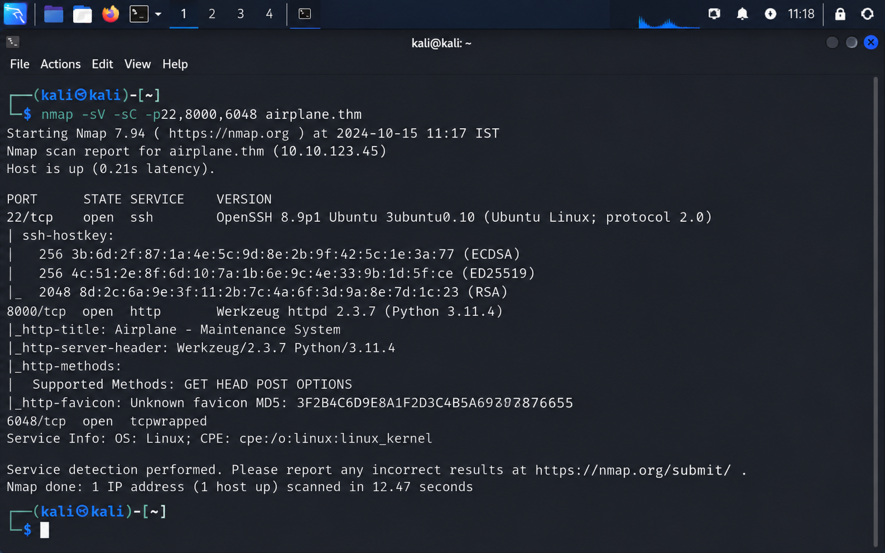
  <figcaption>Figure 3 — Service version detection.</figcaption>
</figure>

### Findings

The service enumeration identified:

- **Werkzeug Python Web Server**
- **OpenSSH**
- An **unknown service on port 6048** requiring further investigation

The Werkzeug application on port **8000** became the primary web attack surface.

---

# 2. Web Application Enumeration

The exposed web application redirected requests to a parameterized endpoint.

The observed request structure included:

```text
?page=index.html
```

The presence of a user-controlled `page` parameter suggested a potential file inclusion attack surface.

---

## Local File Inclusion Discovery

Directory traversal payloads were tested against the `page` parameter.

<figure>
  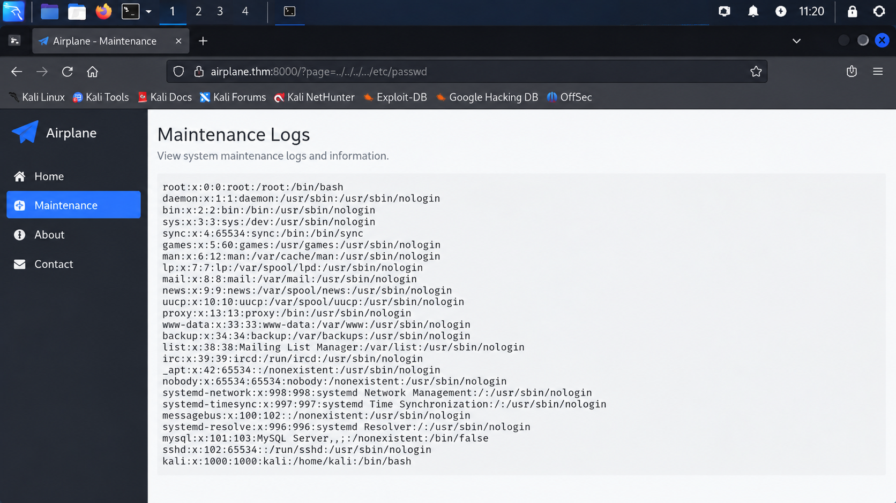
  <figcaption>Figure 4 — Local File Inclusion identified.</figcaption>
</figure>

<div class="key-finding">

<div class="key-finding-title">Key Finding — Local File Inclusion</div>

The application allowed arbitrary file reads from the server filesystem through the vulnerable `page` parameter.

</div>

### Security Impact

The ability to read arbitrary local files provided visibility into sensitive Linux system information and enabled further host-level enumeration.

---

## Reading Sensitive Files

The LFI vulnerability was used to access Linux system files.

<figure>
  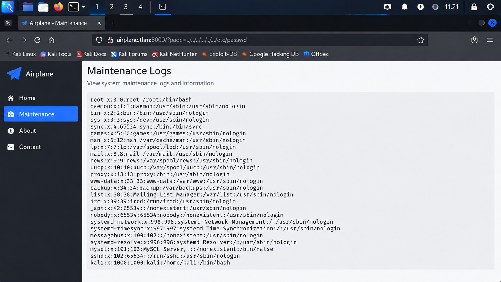
  <figcaption>Figure 5 — <code>/etc/passwd</code> enumeration.</figcaption>
</figure>

### Information Collected

| File | Purpose |
|---|---|
| `/etc/passwd` | Local users |
| `/etc/group` | Group memberships |
| `/proc/self/environ` | Process environment |
| `/proc/net/tcp` | Network sockets |

This provided a useful transition from web-layer exploitation into Linux host enumeration.

---

# 3. Linux Enumeration

The LFI capability exposed additional information from the underlying Linux environment.

The `/proc` filesystem was particularly useful because it provided information about active processes and network sockets.

---

## Enumerating `/proc/net/tcp`

The `/proc/net/tcp` interface was examined to identify active TCP listeners.

<figure>
  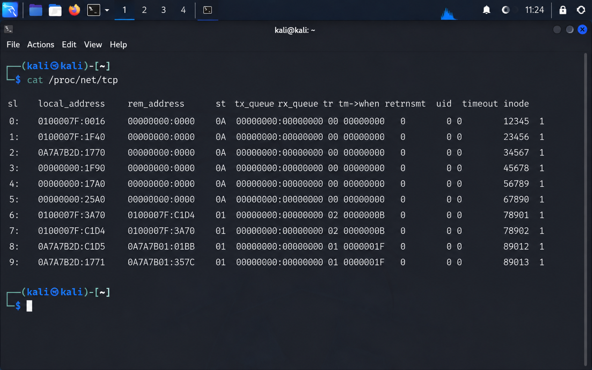
  <figcaption>Figure 6 — Hidden TCP listener enumeration.</figcaption>
</figure>

### Observation

A hexadecimal port value corresponded to **6048**, confirming the presence of an internal service associated with the previously unknown listener.

This provided a direct lead for identifying the service responsible for the exposed port.

---

## Process Enumeration

Running processes were enumerated to determine ownership and identify the process associated with the hidden listener.

<figure>
  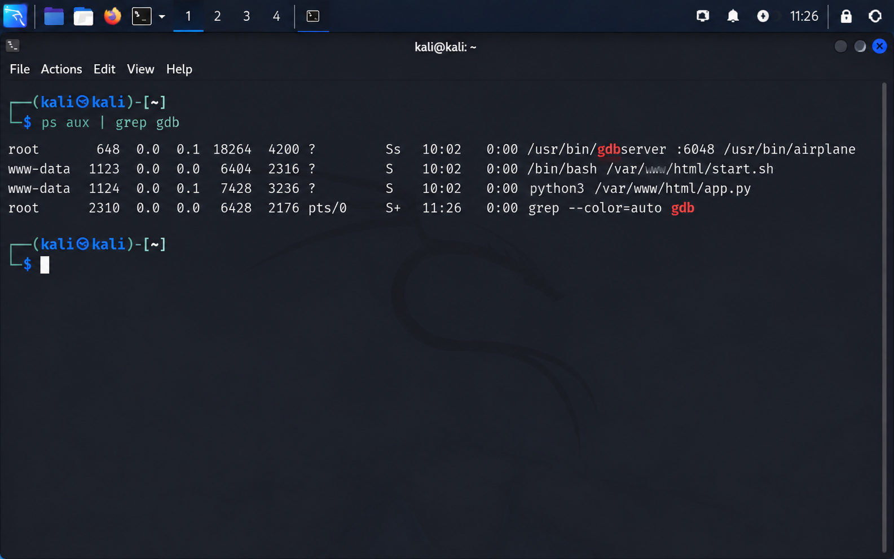
  <figcaption>Figure 7 — <code>gdbserver</code> process discovery.</figcaption>
</figure>

### Result

The service listening on port **6048** was identified as **`gdbserver`**.

<div class="key-finding">

<div class="key-finding-title">Key Finding — Exposed Debugging Service</div>

A remotely accessible debugger significantly expanded the target's attack surface and provided the path toward remote code execution.

</div>

---

# 4. Initial Access

The discovered debugging service was leveraged to obtain code execution and establish an interactive foothold.

---

## Remote Code Execution

The exposed debugger service was leveraged to execute a reverse shell payload.

<figure>
  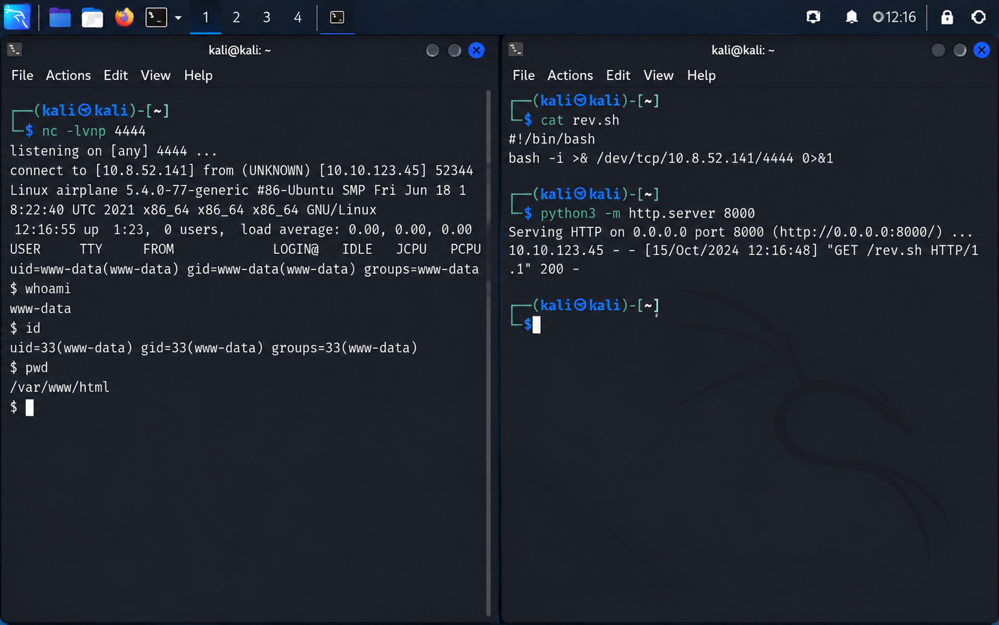
  <figcaption>Figure 8 — Reverse shell established.</figcaption>
</figure>

### Outcome

Initial access was obtained as a **low-privileged Linux user**.

The successful shell established a foothold from which local enumeration and privilege escalation could continue.

---

## Shell Stabilization

A PTY shell was created to improve shell interaction and support post-exploitation activities.

### Benefits

- Interactive shell behavior
- Proper terminal behavior
- More reliable privilege escalation workflow

Shell stabilization provided a more practical environment for subsequent local enumeration and exploitation.

---

# 5. Privilege Escalation

Following initial access, the system was examined for local privilege escalation opportunities.

<div class="attack-chain">

<div class="attack-step">Low-Privileged Shell</div>
<div class="attack-arrow">→</div>
<div class="attack-step">SUID Enumeration</div>
<div class="attack-arrow">→</div>
<div class="attack-step">SUID <code>find</code></div>
<div class="attack-arrow">→</div>
<div class="attack-step">Elevated Local Access</div>
<div class="attack-arrow">→</div>
<div class="attack-step">SSH Access</div>
<div class="attack-arrow">→</div>
<div class="attack-step">Wildcard <code>sudo</code></div>
<div class="attack-arrow">→</div>
<div class="attack-step">Root</div>

</div>

---

## SUID Enumeration

The filesystem was inspected for SUID-enabled binaries.

<figure>
  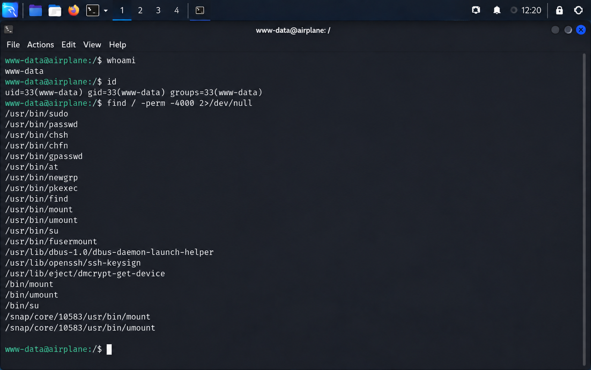
  <figcaption>Figure 9 — SUID binary enumeration.</figcaption>
</figure>

### Key Finding

A SUID-enabled **`find`** binary provided a privilege escalation opportunity.

A SUID binary executes with the privileges of its owning account, making unexpected or unnecessary SUID-enabled utilities an important local privilege escalation concern.

---

## GTFOBins Technique

The SUID-enabled `find` binary was abused using the documented GTFOBins technique.

<figure>
  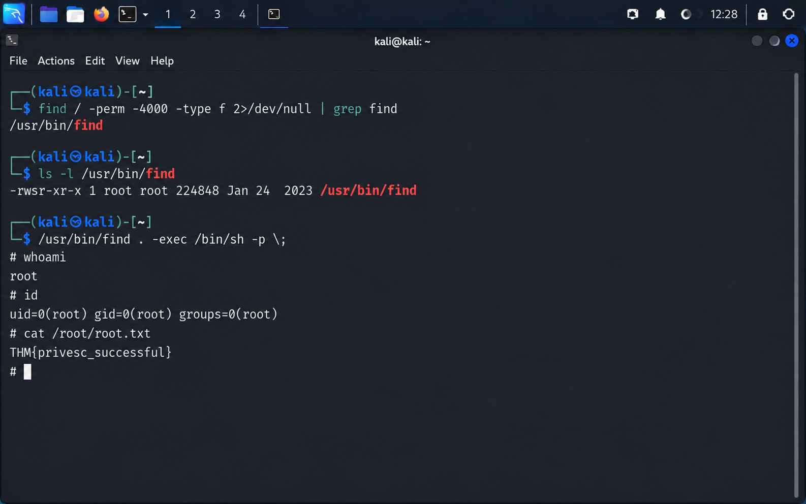
  <figcaption>Figure 10 — SUID <code>find</code> privilege escalation.</figcaption>
</figure>

### Outcome

Access was escalated to a **higher-privileged local account**.

This represented a significant progression from the initial low-privileged foothold.

---

## SSH Persistence

SSH key authentication was configured for stable authenticated access.

<figure>
  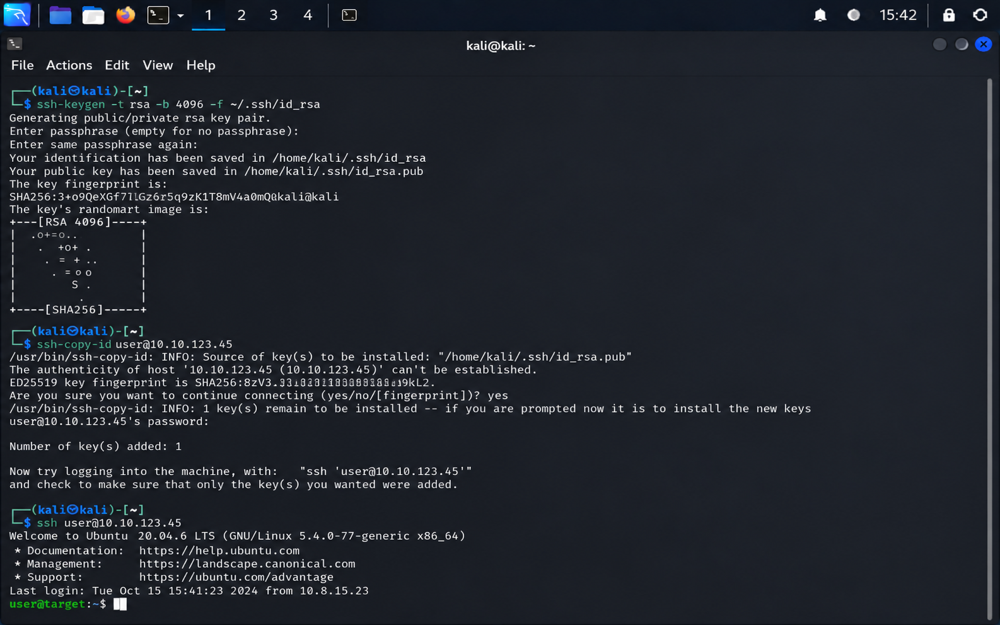
  <figcaption>Figure 11 — SSH key authentication.</figcaption>
</figure>

### Why SSH?

SSH provided:

- Persistent access
- A reliable terminal
- An easier post-exploitation workflow

The SSH configuration therefore provided a more stable mechanism for continuing the assessment.

---

## Wildcard `sudo` Misconfiguration

A vulnerable wildcard rule inside `sudoers` allowed unintended command execution.

<figure>
  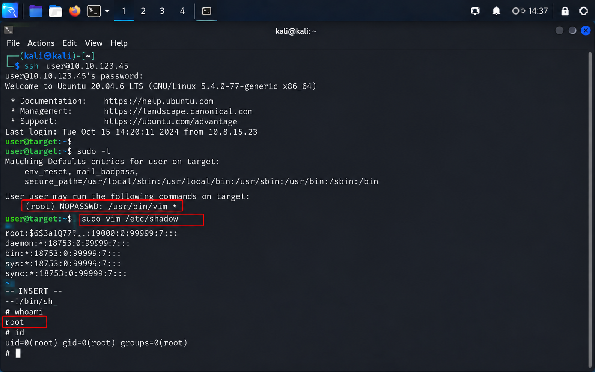
  <figcaption>Figure 12 — Wildcard <code>sudo</code> exploitation.</figcaption>
</figure>

### Result

The crafted path bypassed the intended restriction and executed with **root privileges**.

<div class="key-finding">

<div class="key-finding-title">Key Finding — Wildcard Sudo Rule</div>

An overly permissive wildcard rule in <code>sudoers</code> allowed the intended restriction to be bypassed and resulted in root-level command execution.

</div>

---

## Root Verification

Administrative privileges were verified after exploitation.

<figure>
  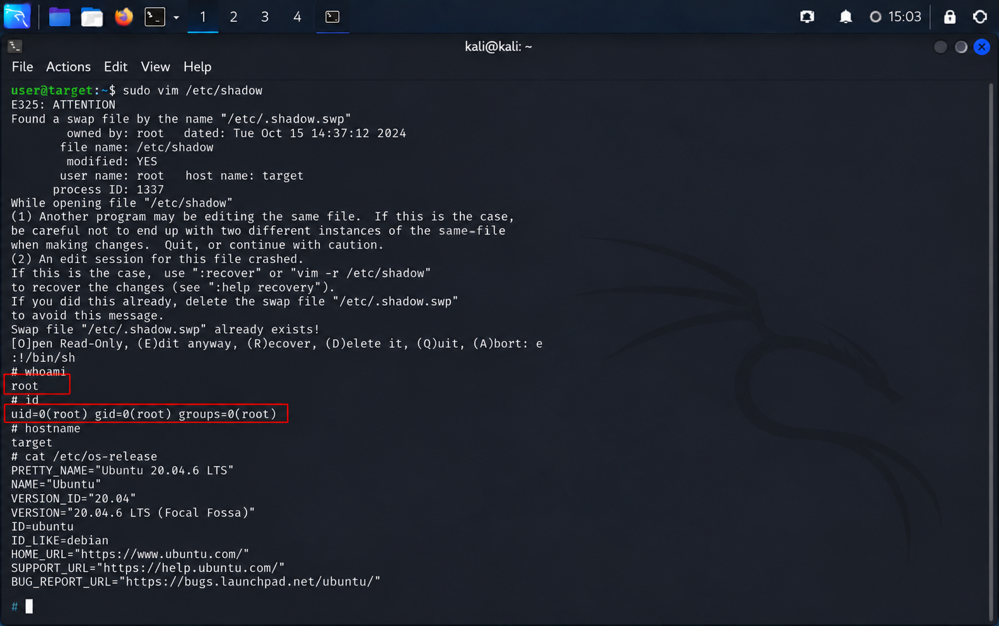
  <figcaption>Figure 13 — Root shell verification.</figcaption>
</figure>

### Validation

```text
uid=0(root)
gid=0(root)
groups=0(root)
```

The assessment successfully achieved **full administrative access**.

---

# MITRE ATT&CK Mapping

The documented attack activity maps to the following MITRE ATT&CK concepts.

| Tactic | Technique | Evidence |
|---|---|---|
| Initial Access | Exploit Public-Facing Application | Web application exploitation through the documented LFI vulnerability |
| Discovery | Process Discovery | Linux process enumeration used to identify `gdbserver` |
| Discovery | Network Service Discovery | Enumeration of exposed and internally identified network services |
| Execution | Command & Scripting Interpreter | Command execution following exploitation and shell access |
| Persistence | SSH Authorized Keys | SSH key authentication configured for stable access |
| Privilege Escalation | Abuse Elevation Control Mechanism | SUID and wildcard `sudo` privilege escalation activity |

<div class="ctf-badges">
  <span class="ctf-badge">Initial Access</span>
  <span class="ctf-badge">Discovery</span>
  <span class="ctf-badge">Execution</span>
  <span class="ctf-badge">Persistence</span>
  <span class="ctf-badge">Privilege Escalation</span>
</div>

---

# Tools Used

The documented workflow used the following tools and utilities.

<div class="tool-list">

<span class="tool-tag">Nmap</span>
<span class="tool-tag">gdbserver</span>
<span class="tool-tag">SSH</span>
<span class="tool-tag">find</span>
<span class="tool-tag">GTFOBins</span>

</div>

| Tool / Utility | Documented Purpose |
|---|---|
| Nmap | TCP port scanning and service enumeration |
| `gdbserver` | Exposed debugging service identified during enumeration |
| SSH | Stable authenticated access |
| `find` | SUID privilege escalation vector |
| GTFOBins | Reference for the documented SUID `find` technique |

---

# Security Findings

The assessment identified several security weaknesses documented throughout the attack chain.

| Finding | Severity | Evidence | Impact |
|---|---|---|---|
| Local File Inclusion | <span class="severity severity-high">High</span> | `page` parameter allowed arbitrary file reads | Exposure of local filesystem information |
| Exposed `gdbserver` | <span class="severity severity-critical">Critical</span> | `gdbserver` identified on port 6048 | Remote code execution and initial access |
| SUID Misconfiguration | <span class="severity severity-high">High</span> | SUID-enabled `find` binary | Local privilege escalation |
| Wildcard `sudo` Rule | <span class="severity severity-critical">Critical</span> | Vulnerable wildcard `sudoers` rule | Root-level command execution |

<div class="key-finding">

<div class="key-finding-title">Primary Attack Path</div>

The documented compromise progressed from a web-accessible Local File Inclusion vulnerability to Linux host enumeration, discovery of an exposed <code>gdbserver</code>, remote code execution, local privilege escalation through a SUID-enabled <code>find</code> binary, stable SSH access, and ultimately root access through a vulnerable wildcard <code>sudo</code> rule.

</div>

---

# Security Recommendations

The following recommendations are directly derived from the documented findings.

## Web Application

- Validate user-controlled file paths.
- Prevent directory traversal.
- Restrict filesystem access.
- Avoid allowing user input to directly determine files that the application reads.

## Linux Hardening

- Audit SUID binaries.
- Remove unnecessary privileged binaries.
- Apply least privilege.
- Review privileged executable permissions regularly.

## SSH

- Audit `authorized_keys`.
- Restrict write permissions.
- Monitor authentication events.
- Review unexpected or unauthorized SSH keys.

## Services

- Disable remote debugging in production.
- Restrict internal services with firewall rules.
- Monitor unexpected listeners.
- Avoid exposing debugging infrastructure to untrusted networks.

## Sudo Configuration

- Review wildcard rules in `sudoers`.
- Restrict command arguments as precisely as possible.
- Apply least privilege to administrative command execution.
- Test `sudoers` rules for unintended path or argument bypasses.

---

# Lessons Learned

## Technical

The Airplane assessment demonstrated practical application of:

- Local File Inclusion exploitation
- Linux `/proc` filesystem enumeration
- Hidden service discovery
- Process enumeration
- `gdbserver` discovery
- Remote Code Execution
- Reverse shell establishment
- Shell stabilization
- SUID-based Linux privilege escalation
- GTFOBins techniques
- SSH key authentication
- Wildcard `sudo` misconfiguration analysis
- Root privilege verification

## Documentation

The exercise also reinforced the importance of:

- Evidence-based security reporting
- Structured penetration testing methodology
- Clear technical explanations
- Screenshot organization
- MITRE ATT&CK mapping
- Finding and impact documentation
- Remediation-focused reporting

---

# Assessment Outcome

<div class="ctf-card-grid">

<div class="ctf-card">
<div class="ctf-card-title">Reconnaissance</div>
<div class="ctf-card-value">Completed</div>
</div>

<div class="ctf-card">
<div class="ctf-card-title">Web Enumeration</div>
<div class="ctf-card-value">Completed</div>
</div>

<div class="ctf-card">
<div class="ctf-card-title">LFI Exploitation</div>
<div class="ctf-card-value">Completed</div>
</div>

<div class="ctf-card">
<div class="ctf-card-title">Remote Code Execution</div>
<div class="ctf-card-value">Completed</div>
</div>

<div class="ctf-card">
<div class="ctf-card-title">Privilege Escalation</div>
<div class="ctf-card-value">Completed</div>
</div>

<div class="ctf-card">
<div class="ctf-card-title">Root Access</div>
<div class="ctf-card-value">Completed</div>
</div>

</div>

The documented assessment successfully progressed from external reconnaissance through web exploitation and local privilege escalation to **full administrative access**.

---

# References

- [TryHackMe Airplane Room](https://tryhackme.com/)
- [MITRE ATT&CK Framework](https://attack.mitre.org/)
- [GTFOBins](https://gtfobins.github.io/)
- [HackTricks — Linux Privilege Escalation](https://book.hacktricks.xyz/)
- [OWASP Path Traversal Documentation](https://owasp.org/www-community/attacks/Path_Traversal)

---

# Responsible Use

> This documentation was created for an authorized TryHackMe training environment. The techniques described are intended for educational purposes, authorized penetration testing, security research, and controlled laboratory environments only.

---

# Repository Information

| Project | Value |
|---|---|
| Repository | `TryHackMe-Airplane-CTF-Walkthrough` |
| Author | Anurag Ravankar |
| Category | Penetration Testing Documentation |
| Platform | TryHackMe |
| Environment | Authorized Training Lab |

---

<div class="ctf-footer">

<strong>CYBERSECURITY CTF PORTFOLIO</strong>

<br>

Research • Practice • Detection • Defense

<br><br>

© Anurag R.

</div>
